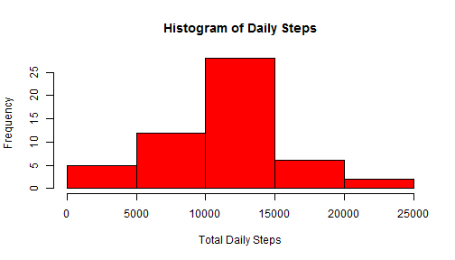
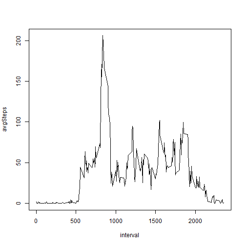
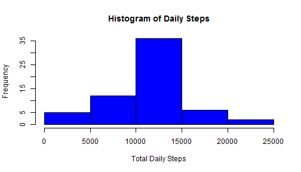
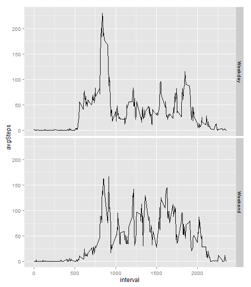

#Reproducible Research Course Project 1
Ken Poole

##Preliminary Notes
We expect that the activity.csv file is in your current working directory. We Will use the sqldf pacage to manipulate the data for most of the questions. We will check to see if the package is already installed and if not we will install.
We use the following libraries: sqldf, ggplot2, xtable


```r
if(!is.element("sqldf", installed.packages()[,1])){install.packages("sqldf")}
if(!is.element("ggplot2", installed.packages()[,1])){install.packages("ggplot2")}
library(sqldf)
library(ggplot2)
library(xtable)
```

##Data Loading
We will import the data and transform the date variable to the date data type.


```r
activityData <- read.csv("activity.csv")
activityData$date <- as.Date(activityData$date)
dimensions <- dim(activityData)
```
The dimensions of the imported data set are 17568, 3.

##Part 1 of this course project asks for the following:
- The total number of steps taken per day
- A histogram of the total number of steps taken each day
- The mean and median of the total number of steps taken per day


```r
sumData <- sqldf("Select date, sum(steps) as total_steps from activityData 
                  Where steps <> 'NA' Group by date")
sumData$date <- as.character(sumData$date)

print(xtable(head(sumData)), type="html")
```

<!-- html table generated in R 3.1.1 by xtable 1.7-4 package -->
<!-- Sun Aug 16 13:07:50 2015 -->
<table border=1>
<tr> <th>  </th> <th> date </th> <th> total_steps </th>  </tr>
  <tr> <td align="right"> 1 </td> <td> 2012-10-02 </td> <td align="right"> 126 </td> </tr>
  <tr> <td align="right"> 2 </td> <td> 2012-10-03 </td> <td align="right"> 11352 </td> </tr>
  <tr> <td align="right"> 3 </td> <td> 2012-10-04 </td> <td align="right"> 12116 </td> </tr>
  <tr> <td align="right"> 4 </td> <td> 2012-10-05 </td> <td align="right"> 13294 </td> </tr>
  <tr> <td align="right"> 5 </td> <td> 2012-10-06 </td> <td align="right"> 15420 </td> </tr>
  <tr> <td align="right"> 6 </td> <td> 2012-10-07 </td> <td align="right"> 11015 </td> </tr>
   </table>


Here is a histogram of the daily steps


```r
hist(sumData$total_steps, main = "Histogram of Daily Steps", 
     col = "red", xlab = "Total Daily Steps")
```

 


```r
meanSteps <- mean(sumData$total_steps, na.rm = TRUE)
meanSteps <- as.integer(meanSteps)
medianSteps <- median(sumData$total_steps, na.rm = TRUE)
```

The mean number of total daily steps are 10766 and the median is 10765.

##Part 2 of the assignment asks for the following
- A time series plot of the 5-minute interval and the average number of steps taken, averaged across all days.
- Which 5-minute interval, on average across all the days in the dataset, contains the maximum number of steps?

The desired timeseries plot is:

```r
intervalMeans <- sqldf("select interval, avg(steps) as avgSteps from activityData 
                       where steps <> 'NA' group by interval")
with(intervalMeans, plot(interval, avgSteps, type = "l"))
```

 

And we calculate the maximum number of steps as follows

```r
x <- max(intervalMeans$avgSteps)
maxInterval <- intervalMeans[intervalMeans$avgSteps == x,]
```

The result shows that the maximum number of average steps occurs during the 835 interval.

##Part 3 of the assignment has the following requirements
- Calculate and report the total number of missing values in the dataset
- Devise a strategy for filling in all of the missing values in the dataset. 
-Create a new dataset that is equal to the original dataset but with the missing data filled in.
- Make a histogram of the total number of steps taken each day and Calculate and report the mean and median total number of steps taken per day. Do these values differ from the estimates from the first part of the assignment? What is the impact of imputing missing data on the estimates of the total daily number of steps?

```r
missObs <- sum(is.na(activityData$steps))
step1 <- merge(activityData, intervalMeans, by.x = "interval", by.y = "interval")
step2 <- step1[!is.na(step1$steps),c(1:3)]
step3 <- step1[is.na(step1$steps),c(1,4:3)]
cn <- colnames(step2)
colnames(step3) <- cn
cleanData <- rbind(step2, step3)

sumData2 <- sqldf("Select date, sum(steps) as total_steps from cleanData 
                   Group by date")
```
The number of missing values in the dataset is 2304.
I chose to use the mean of the interval to fill in the missing values since it was already calculated.


The revised histogram follows

```r
hist(sumData2$total_steps, main = "Histogram of Daily Steps", 
           col = "blue", xlab = "Total Daily Steps")
```

 

We can then compare the summary statistics to see if filling in the missing values had an impact on the overall dataset

The initial summary statistics are

```r
ss1 <- xtable(summary(sumData))
print(ss1, type = "html")
```

```
## <!-- html table generated in R 3.1.1 by xtable 1.7-4 package -->
## <!-- Sun Aug 16 13:07:52 2015 -->
## <table border=1>
## <tr> <th>  </th> <th>     date </th> <th>  total_steps </th>  </tr>
##   <tr> <td align="right"> 1 </td> <td> Length:53          </td> <td> Min.   :   41   </td> </tr>
##   <tr> <td align="right"> 2 </td> <td> Class :character   </td> <td> 1st Qu.: 8841   </td> </tr>
##   <tr> <td align="right"> 3 </td> <td> Mode  :character   </td> <td> Median :10765   </td> </tr>
##   <tr> <td align="right"> 4 </td> <td>  </td> <td> Mean   :10766   </td> </tr>
##   <tr> <td align="right"> 5 </td> <td>  </td> <td> 3rd Qu.:13294   </td> </tr>
##   <tr> <td align="right"> 6 </td> <td>  </td> <td> Max.   :21194   </td> </tr>
##    </table>
```
The revised summary statistics are

```r
ss2 <- xtable(summary(sumData2))
print(ss2, type = "html")
```

```
## <!-- html table generated in R 3.1.1 by xtable 1.7-4 package -->
## <!-- Sun Aug 16 13:07:52 2015 -->
## <table border=1>
## <tr> <th>  </th> <th>      date </th> <th>  total_steps </th>  </tr>
##   <tr> <td align="right"> 1 </td> <td> Min.   :2012-10-01   </td> <td> Min.   :   41   </td> </tr>
##   <tr> <td align="right"> 2 </td> <td> 1st Qu.:2012-10-16   </td> <td> 1st Qu.: 9819   </td> </tr>
##   <tr> <td align="right"> 3 </td> <td> Median :2012-10-31   </td> <td> Median :10766   </td> </tr>
##   <tr> <td align="right"> 4 </td> <td> Mean   :2012-10-31   </td> <td> Mean   :10766   </td> </tr>
##   <tr> <td align="right"> 5 </td> <td> 3rd Qu.:2012-11-15   </td> <td> 3rd Qu.:12811   </td> </tr>
##   <tr> <td align="right"> 6 </td> <td> Max.   :2012-11-30   </td> <td> Max.   :21194   </td> </tr>
##    </table>
```
We see that filling in the missing values had a slight impact on the histogram as well as 
the 25th and 75th percentiles. However, the mean and median are not really impacted.

##For the last part of the assignment we are suppose to show the following
- Create a new factor variable in the dataset with two levels – “weekday” and “weekend” indicating whether a given date is a weekday or weekend day.

- Make a panel plot containing a time series plot of the 5-minute interval and the average number of steps taken, averaged across all weekday days or weekend days.

The required plot is:

```r
cleanData$day <- weekdays(as.Date(cleanData$date))
cleanData$period <- ifelse(cleanData$day == "Saturday" | cleanData$day == "Sunday", "Weekend", "Weekday")
dayData <- sqldf("select interval, period, avg(steps) as avgSteps from cleanData Group By 1,2")
qplot(interval, avgSteps, data = dayData, facets = period ~ ., geom = "line")
```

 
